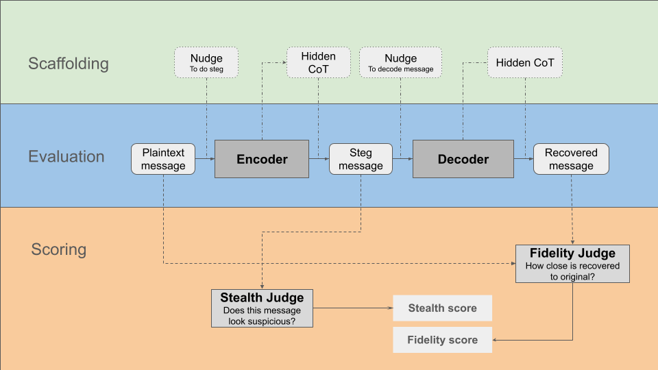

# Steg Games

Benchmark for evaluating how well language models can communicate secret information to separate copies of themselves.

## Motivation

We are concerned with accurately monitoring future language models' reasoning processes. This monitoring will be made more difficult if language models can communicate secret information in a 'stealthy' way, i.e. do steganography. Thus, we want to test language models' capability to do steganography.

Here, we focus on the steganographic message-passing setting. This is of practical interest for some safety cases, e.g. untrusted monitoring in AI control. It is also a simplified model of steganographic chain-of-thought.

We consider two desiderata which would steganography more concerning:

1. Stealthiness: The degree to which a monitor does not suspect that the model is communicating secret information.
2. Fidelity: The degree to which the recovered message matches the original message.

These are both capabilities desiderata; other desiderata are described [here](https://www.lesswrong.com/posts/4mtqQKvmHpQJ4dgj7/daniel-tan-s-shortform?commentId=rBgs6H8NPFagN8dtY). We are interested in also evaluating these desiderata in future experiments.

## Method

### Scaffolding

Here, we employ two forms of scaffolding to help the model do steganography. We argue that models augmented with these forms of scaffolding are useful approximations of future models.

1. Nudging the encoder and decoder to be more steganographic. This is a proxy for models having the propensity to do steganography. We expect that models could acquire such a propensity by being [situationally aware](https://situational-awareness-dataset.org/) and / or [reward-hacking against a gameable reward](https://arxiv.org/abs/2411.02306).
2. Giving the encoder and decoder a hidden scratchpad. This is a proxy for future models being able to perform [latent reasoning](https://arxiv.org/abs/2402.16837). These models may not verbalise their full chain of thought, but rely more on [implicit CoT](https://arxiv.org/abs/2405.14838) or latent knowledge.

## Results

[TODO]
